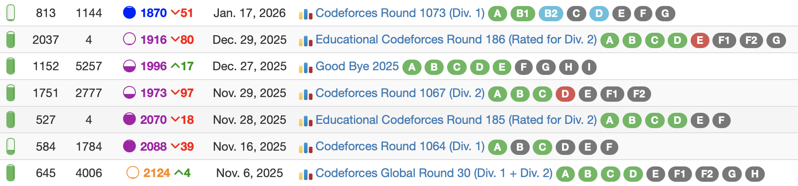
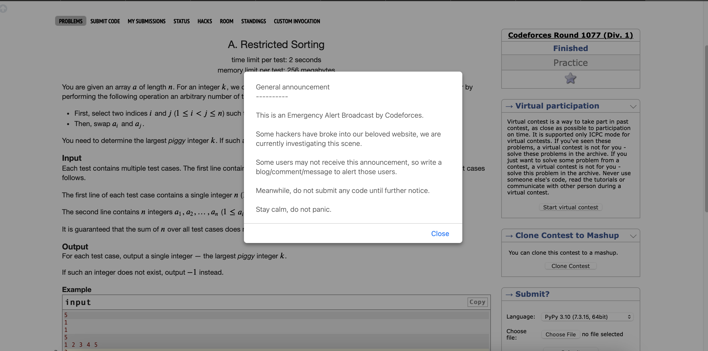
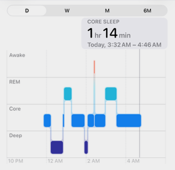

:::{.callout-note collapse="true"}

## Context to the Icon Image

This post is part of the Februrary 21st-23rd set of posts detailing a rather chaotic day of competitive programming, hence why I have an old classic introduction image of Days of Our Programmers, a somewhat satrical introduction method I used in a few archive logs when preceeding some really unfortunate competitive programming implosions. If you want an idea of what said implosions look like, [November 2022's Archive Log](https://alxwen711.github.io/HonestCode/posts/archive/2022-11/#november-16st-30th) is an example of what such implosions can look like. The good news is that it'll be apparent that there wasn't a massive underachievement in any of the contests recapped in this miniseries. 
:::

To properly understand the importance of this contest we need some context. In the short term this is the most important of the competitions I did from February 21st to 23rd as there are only so many of these competitions I can do since they basically have to either be on the weekend, or I have to be at UBC by 6:30AM in the cases where I want to do these contests and attend classes. Further more, we have my CodeForces history via CLIST since November:



Yes, rating is not everything, but dropping 254 ELO over the course of 6 contests is not exactly good. Screwing up here means that unless I decide to go to UBC early Monday morning, the next chance I will have to get back to 1900 ELO will be **March 16th**. I'd much rather not wait that long. So it suffices that this is quite critical. Adding to that as some sort of omen was the night before, CodeForces got hacked.



The hack only really consisted of these pop-ups last night but this was a genuinely new experience for me. Thankfully it seemed that around 11PM the night before this situation was mostly controlled, so the contest now goes as planned.

## Solved Problems

### [A: String Rotation Game](https://codeforces.com/contest/2192/problem/A)

We can first check the number of blocks in the string without any rotation. Then we have several cases where this is the maximum number of blocks:

- The first and last character of the string are identical; if a cyclic shift occurs, these endpoints may be combined and any new block that would be created would be neutralized as a result. (Also covers the case where there is only one block)
- Every block is of length 1, then every character is different from its neighbours and shifting does nothing.

Otherwise, then a shift will not combine the first and last characters into a single block, and there exists a block of at least length two that can be split to the first and last characters by this method, thus increasing the number of blocks by 1 (which is the maximum).

**[Sample code](https://github.com/alxwen711/contestSubmissionArchive/blob/main/codeforces/live%20contests/2026-1/1081/a.py)**

### [B: Flipping Binary String](https://codeforces.com/contest/2192/problem/B)

The order in which the bits are flipped do not matter (flipping bit i then j will have the same string as flipping bit j then i), which implies only the parity of 0's and 1's matter.

Let `x` be the number of 1's and `y` be the number of 0's.

- If `x` is even, then perform the operation on all of the 1's. The 0's will be flipped x times, an even number, meaning they'll stay as 0's. The 1's will be flipped x-1 times, an odd number, meaning they'll change to 0's.
- If `x` is odd, then check if `y` is odd. If it is, then performing the operation on all the 0's will ensure each 1 is flipped an odd number of times and each 0 is flipped an even number of times.
- If `x` is odd and `y` is even, this is impossible. There is no reason to consider if only part of the 0's/1's need to be flipped.

**[Sample code](https://github.com/alxwen711/contestSubmissionArchive/blob/main/codeforces/live%20contests/2026-1/1081/b.py)**

### [C: All-in-one Gun](https://codeforces.com/contest/2192/problem/C)

Regardless of what swap in the bullet sequence is made, the enemy will always survive through `h//x` magazines, where `x` is the sum of the damage done by all bullets. After computing this, we then consider how to optimize the magazine to deal the remaining damage as fast as possible.

For some first `k` bullets, the optimal method is to swap the lowest value in the first `k` bullets with a higher one in the last `n-k` bullets if it exists. I find the simplest way to track this is to use suffix array to track the maximums, which is for a magazine array `A`, the suffix maximums `B` would be the following:

```
A = [4,2,3,5,3]
B = [5,5,5,3,3]
C = [0,4,6,9,14]
```

`C` is basic prefix sum for the first 0 to `n-1` bullets. Then the maximum damage possible with `k` bullets is `C[k-1]+B[k-1]`. Since `C[k] <= C[k+1]` for every `0 <= k < n`, it is possible to compute the optimal `k` with a binary search as that is an idea I initially thought of and one of this problem's tags, which results in a similar computation process.


**[Sample code](https://github.com/alxwen711/contestSubmissionArchive/blob/main/codeforces/live%20contests/2026-1/1081/c.py)**

### [D: Cost of Tree](https://codeforces.com/contest/2192/problem/D)

This is where the interesting contest strategy occurs, because when I reached this problem, I noticed that Problem E already had 6 solves while this problem had none, so I was tempted to skip this first especially since this is a tree problem. After looking at both problems though, I ended up trusting myself and went for D since I had a much better idea of where to begin. There is quite a lot of necessary information to store about each node for this problem, so to explain my thought process, it's best to show how I defined a node, with comments describing what each attribute represents:

```python
class Node:
    def __init__(self,v):
        self.val = v # value of the node
        self.depth = -1 # depth of the node from the root which has depth 0
        self.edges = {} # set-like structure for tracking neighbouring nodes
        self.total = v # sum of the values of the nodes in this subtree
        self.score = 0 # cost of this subtree without making an operation
        self.best = 0 # highest possible cost increase in this subtree from an operation
        self.md = -1 # highest depth of a node from a child's subtree
        self.md2 = -1 # self.md while excluding all nodes from the child subtree self.md came from
```
:::{.callout-caution collapse="false"}
## Classes in Python Should Be Used More Than What I Do Here

While it is pretty clear that competitive programming code in terms of structural quality tends to be very low for proper software development standards, there is merit in actually having good code structure as I find it helps organizes my thoughts more easily. In this sense, most of the classes I create within competitive programming code are containers for objects to store their traits for which I then manipulate outside the class structure. In this sense I'm effectively using the Python classes like C `struct` types due to the lack of methods, which is something for myself to work on.
:::

From all of this, the main technique I know for tree dynamic programming problems is to work from the leaves of the tree and go upwards to the root. This method then works as follows:

- First determine all the proper `val`, `depth`, and `edges` values for each node.
- Determine some method for travering the nodes from the leaves and upwards, saving root for last. Going in highest to lowest node depth works.
- `total` can be computed by adding a node's child totals to it, where the base case for a node with no children is its own value.
- `score` can be computed by adding a node's child totals AND child scores to it, where the base case for a node with no children is 0.
- If a node has no children, then `best` must be 0 (due to having no further nodes to move around).
- If a node has 1 child, then `best` is equal to the `best` value of the child because you cannot detach current node from child as an operation.
- If a node has mutiple chidren, then for each child node, determine the depth of the deepest node of the subtree not in this child's subtree (using `md` and `md2`). The difference in depth times the child's `total` is the increase in cost performing this operation. Repeat with all child nodes to update `best`.

This entire process will then have each node processed in $O(1)$ time at most three times: once to find it's own answer which is `score+best` and possibly up to two times as a child node to a direct parent. This then summarizes the entire algorithm in $O(n)$ time.

**[Sample code](https://github.com/alxwen711/contestSubmissionArchive/blob/main/codeforces/live%20contests/2026-1/1081/d.py)**

## Unsolved Problems

### [E: Swap to Rearrange](https://codeforces.com/contest/2192/problem/E)

Before going back to solve D, I initially looked at this question and hypothesized a greedy idea, as my initial thought was to compute `D[x]` where for a value `x`, D[x] equals the number of times `x` shows up in `A` minus the number of times `x` shows up in `B`. Then a positive value indicates that `x` values need to be swapped from `A` to `B`, negatives mean `x` should go from `B` to `A`, and if every `D[x]` is 0 then the arrays are balanced. This then divides the possible operations by index into 3 groups. For a pair `(x = A[i],y = B[i])` swapping these brings either both, one, or none of the values `D[x]` and `D[y]` closer to 0. I then tried finding ideas to perform operations in the first group as often as possible, only considering the second group when necessary, but I gave up on this idea after about 20 minutes when it became ambiguous as to how to choose between operations in the same group.  

After thinking about this longer, I then thought this problem felt similar to the [2-SAT](https://cp-algorithms.com/graph/2SAT.html) problem, which constructs the boolean restrictions as a graph to solve the problem. I already made the initial observation that if a solution exists, then each value shows up across both arrays an even amount of times. I then constructed a graph where an edge was created for each `(A[i],B[i])` pair, ensuring that every node in the graph was of even degree. This means that the graph can be decomposed into cycles; ie. there exists a way to assign directions to all the edges so that the resulting graph ends up being a set of disjoint cycle graphs. We can then take the directed edges as the configuration for which to balance `A` and `B` to, swapping pairs where needed to match the directed edge configuration.

At this point though, partially since this at the time was something I only assumed was correct, I wasn't actually sure how to decompose the graph into cycles. It turns out while decomposing a graph into the fewest number of cycles possible is an NP-Hard problem, finding any valid cycle decomposition can be done near abritarily; I wrote during the contest I was using some greedy method but the reality was that I just threw random edges and it kept making cycles. Part of this also was that I ended up submitting a solution to this problem with about 5 minutes in the contest left. Strangely, this ended up with a `Memory Limit Exceeded` verdict on pretest 2, which is an error I have seen on about one problem before this. At this point I had no clue how to resolve this and attempted some memory optimization but this wasn't enough to solve the problem in time. Post contest, I tried using `Counter` instead of standard dictionaries to track edges thinking this may reduce the memory limit, which didn't work. Then after further debugging, I end up with [WA test 3](https://codeforces.com/contest/2192/submission/363967501) and [Runtime error on test 2](https://codeforces.com/contest/2192/submission/363967555) cases that use near the exact same method, just with a few sanity checks to make sure the dictionary setups were never getting negative counts of edges. It's at this point that I'm reasonably sure the MLE was a weird implementation error side effect, as further reading on this problem shows that every connected component of this graph can be expressed as an [Euler Path](https://cp-algorithms.com/graph/euler_path.html), ie. only one cycle per component is needed, and that the formula for such is simpler than my implementation suggests otherwise.


**[Sample code](https://github.com/alxwen711/contestSubmissionArchive/blob/main/codeforces/live%20contests/2026-1/1081/e.py)**

### [F: Fish Fight](https://codeforces.com/contest/2192/problem/F)

Due to the above mess taking up quite a while of the weekend to resolve, I was unable to really observe this problem in depth. From a basic look I am assuming there is some sort of weird $O(n^2)$ greedy idea to compute the fish behaviours and the respective probabilities.


## Contest Reflection

Due to a higher than expected solve rate for problems D and E, even though I made few significant time errors and no wrong submissions, I ended up gaining only +10 ELO to go to 1880, meaning I'm still in Expert somehow. It's very much a contest where I clearly met my floor expectation for performance, and there is some credit to me for actually getting reasonably close to solving E since I've had cases recently where I'd get completely stuck at that level. I still at least have CF Round 1082 on February 23rd if I can wake up for it to try and reach 1900. But surely I'm not that nuts to actually wake up at 5am for this.

