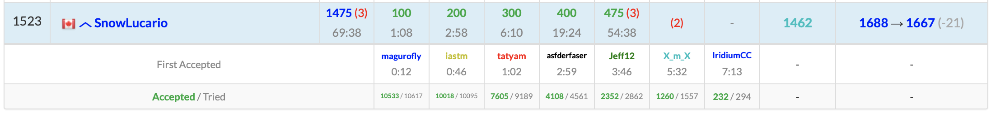
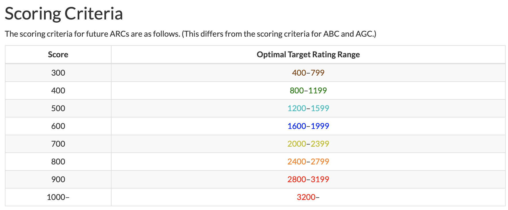
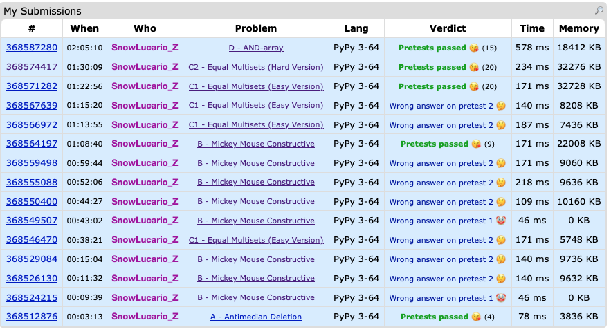
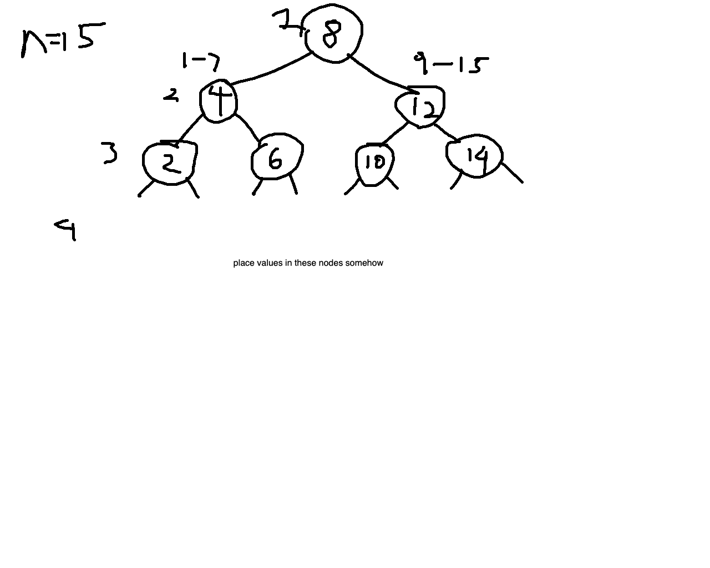
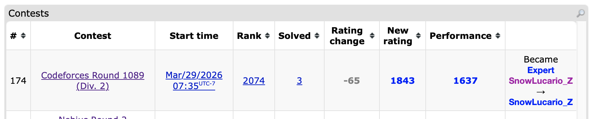

Okay I did say a NAC post (or posts) would be coming up soon and there is content there. I did make a [Linkedin Post](https://www.linkedin.com/feed/update/urn:li:activity:7442079537053638656/) about it, which seeing that the only other post ever made there was about my acceptance into the MDS program, is a pretty high bar. If this was a slow week with not many competitions, I'd write more on something involving NAC. Alas, because Daylight Savings is permanent now, the Nebius Round 2 was at 7:35 AM, but more importantly, I even get to have a mini AtCoder recap!


:::{.callout-note collapse="true"}
## Mini Atcoder Beginner Contest 451 Recap + Leetcode Weekly 495 Fun Notes



So it turns out it might take me a few weeks to get used to having my brain work at 5AM again. A few notes here:

- Interestingly since the last time I was on AtCoder last September, an [announcement about AtCoder Regular Contests](https://atcoder.jp/posts/2026ARC_en) was made which has a very interesting table for intended problem difficulties:



This table shows the intended problem difficulty given the number of points allocated to the problem, so for instance, we'd expect a 400 point problem to be of roughly 1000 difficulty, so someone rated 1000 would theoretically have about a 50% chance of solving it. This scoring setup is meant for regular contests, but we can utilize it for beginner contests, even if extrapolating for 100 and 200 point problems is somewhat tricky. For now, we'll just assume a piecewise linear function with linear segments from 100 to 200 points and 200 and 300 points so that a 100 point problem equals a 0 rating and 200 points equals a 200 point rating. 

Viewing my performance above, the highest problem I solved was [E: Tree Distance](https://atcoder.jp/contests/abc451/tasks/abc451_e) at 475 points, which is roughly expected to be around a 1300 rated problem. Also [F: Make Bipartite 3](https://atcoder.jp/contests/abc451/tasks/abc451_f) is 500 points and I just missed this. 500 points translates to around a 1400 rating, although it is typical for there to be more of a solve rate dropoff from E to F than this point difference indicates. Generally assuming a linear setup, the estimated problem difficulties from the score range are listed in this table:


| Problem| A | B | C| D| E| F|G|
|---|---|---|---|--|-|-|-|
|Score|100|200|300|400|475|500|600|
|Estimated by Score Table|0|200|600|1000|1300|1400|1800|
|[Kenkoooo Projection](https://kenkoooo.com/atcoder/#/table/)|11|36|275|856|1215|1540|TBD|
(CList projection and Kenkoooo G will be added once available)

According to Kenkoooo, the earlier problems tend to be overestimated if going by score alone, but E and F are actually quite close to expected. It may be interesting to see if this pattern starts to become more prevalent in the long run.

- A 36 rating for B kinda checks out given that I solve A and B in 3 minutes.

- Python really hates tuples for sorting/hashing/anything purposes, it is almost always better to hash tuples to an integer value. That explains how there are 3 wrong submissions in E. That and I missed a line in my Djisktra implementation that ensure no redundant states were being checked.

- I absolutely had the correct idea for F. The main idea is to use union find to track which components are connected efficiently, then any time there is two components being connected, you are able to flip the colours of all the nodes on the smaller component if necessary to ensure the 2 colouring of the graph is upheld. If at any point an edge is added that does not colour a new node, does not connect any components, and connects two same coloured nodes together, then the bipartite condition is impossible from then on. Tracking the minimum number of black nodes is where I tripped up as I had to pretty much keep track of the number of nodes of each colour on each connected component. The actual computation when connecting components is reasonably simple; subtract the black node count on the two components and readd the minimum black count on the combined component. It just happens that I had some implementation issues here.

- Funny enough, Leetcode Weekly 495's [last problem](https://leetcode.com/problems/incremental-even-weighted-cycle-queries/) also happened to use a very similar node flipping and union technique. So by some dumb luck, I'm pretty sure my practice at 5AM ended up prepping me for the 7:30PM Leetcode I only did because well... you'll see from the Nebius recap.

- Unbeliveably, I'm also projected to drop in Leetcode rating in spite of solving all four problems in an hour. 2400+ ELO on Leetcode is pain.
:::

Okay so that was a very long sidenote. Now for the actual recap:

## Solved Problems

### [A: Antimedian Deletion](https://codeforces.com/contest/2211/problem/A)

This was a bit of a mini gaslighting problem in that I kept thinking for a while that this was more complex than either putting `1` for a length `1` array or a bunch of 2's since there would always be either the smallest or largest value that could be deleted instead of whatever `i` was. It turns out it really is that easy.

**[Sample code](https://github.com/alxwen711/contestSubmissionArchive/blob/main/codeforces/live%20contests/2026-1/1088/a.py)**

### [B: Mickey Mouse Constructive](https://codeforces.com/contest/2211/problem/B)

This problem it's best to explain the solution I ended up with first.  This idea then carries on to how factors are involved; the entire sum of the array will be `x-y`, where `x` is the number of 1's and `y` is the number of 0's. Regardless of how the numbers are arranged, if `c` divides `x-y` (assuming `x-y` is not 0) and `(x-y)/c` is positive, it is always possible to make this exact number of subarrays each with sum `c`, which can be shown via a recursive procedure (take a prefix of the array until it sums to `c`, repeat with the remaining suffix until all subarrays are made). Thus the number of positive factors of `x-y` is the answer. As for a possible setup, I first made the correct assumption that placing all the 1's and the all the -1's sequentially would be optimal. This is more clear if the number of 1's and -1's are equal; the sum of the entire array must be 0, so any division must have each subarray sum to 0.

**[Sample code](https://github.com/alxwen711/contestSubmissionArchive/blob/main/codeforces/live%20contests/2026-1/1088/b.py)**

Now that the solution is clear, here is the very much not painful to recap at all process of how I ended up drunkenly stumbling to this solution:

:::{.callout-warning}
## What I Did on B For Over An Hour, A Brief Comedy Act of How Even CMs Can Be Silly

Here is an interesting part of the problem statement:

> You are given two integers 𝑥 and 𝑦. Find the minimum value of 𝑓(𝑎) over all arrays 𝑎 of length 𝑥+𝑦, consisting of 𝑥 copies of the number 1, and 𝑦 copies of the number −1 in some order. Since this answer may be large, output the answer modulo 676767677. Additionally, you should construct one array that achieves this minimal value.

Now, seeing the solution above, we know this modulo is basically meaningless in this question since `x-y` is only going up to 200000. The slight issue the following:

1. I read through this problem very fast and just assumed something basic in the solution had to be taken with a modulo 
2. My brain was smooth

I know this is supposed to be critical analysis of my mistakes here, but I really can't defend it. I mean, look at this first attempt:

```python
for _ in range(readint()):
    x,y = readints()
    ans = list()
    for _ in range(x):
        ans.append(1)
    for _ in range(y):
        ans.append(-1)
    if x != 0 and y != 0:
        if (x+y) % 2 == 0: print(2) 
        else: print(1)
    else:
        print(pow(2,x+y-1,m))
    print(*ans)
```

Pretty much I first guessed that if there are only 1's or 0's, for some reason it meant any partition could work (`1 | 1 1` does not), and otherwise, there was some strange even/odd parity attempt being done. This error was due to oversimplifying the observations made by the samples; yes usually it is possible to get away with this in problem A, but definitely not here. Oh and also this fails pretest 1 entirely. [And somehow I'd have a second submission that also had WA pretest 1.](https://codeforces.com/contest/2211/submission/368549507).

By the second WA pretest 1 submission (and 4th overall), I had already been jumping back and forth between this problem and C1 for 45 minutes, so at this point desperation was kicking in. Then [attempt 5](https://codeforces.com/contest/2211/submission/368550400) fails. In fairness, I had done some actual testing in the comment of this submission shown below:

```python
"""
x 1's, y -1's
if there is a -1, split to end
 
 
1 1 -1 -1
 
1 1 1 1 1 -1
 
5 3
1 1 1 1 1 -1 -1 -1
 
 
3 4
1 1 1 -1 -1 -1 -1 -1 -1
 
odd length is definitely 1 partition
if x == y, must be 1
x and y are even, must be 1
 
1 1 1 1 -1 -1
 
x and y are odd, must be 2
"""
```

The slight issue is that I had concluded that if x and y are even, the answer must be 1, and then wrote out a literal test case `1 1 1 1 -1 -1` where this is obviously not the case. I of course respond appropriately in the next submission:

```python
 
"""
x 1's, y -1's
if there is a -1, split to end
 
 
1 1 -1 -1
 
1 1 1 1 1 -1
 
5 3
1 1 1 1 1 -1 -1 -1
 
 
3 4
1 1 1 -1 -1 -1 -1 -1 -1
 
odd length is definitely 1 partition
if x == y, must be 1
x and y are even, must be 1
 
1 1 1 1 -1 -1
 
x and y are odd, must be 2
 
how drunk are we
 
1   ?????      1 1 1 -1 -1
 
x and y are even or x and y are odd MUST be 2 IF x != y
 
 
1 4 screws this thinking up
1 -1 -1 | -1 | -1
 
3 6?
1 1 1 -1 -1 -1 -1 -1 -1
"""
```

`how drunk are we`

Masterful stuff. Also at this point I had still not recognized the whole factor observation. Thankfully [attempt 7](https://codeforces.com/contest/2211/submission/368559498) was where this was finally adjusted, and then that's when I finally look back and see the whole `print(pow(2,x+y-1,m))` accident and finally get AC on [attempt 8](https://codeforces.com/contest/2211/submission/368564197). This took over an hour to finish up a problem that is roughly 900 rated.



Did I mention this problem took an actual CM an hour.
:::


### [C1: Equal Multisets (Easy Version)](https://codeforces.com/contest/2211/problem/C1)

Truthfully, after the mess that was the previous problem, I ended up solving this problem almost entirely by proxy of solving C2. I'll just add my submitted solution here and explain it fully in C2.

**[Sample code](https://github.com/alxwen711/contestSubmissionArchive/blob/main/codeforces/live%20contests/2026-1/1088/c1.py)**

### [C2: Equal Multisets (Hard Version)](https://codeforces.com/contest/2211/problem/C2)

For some reason I tried greedy insertion techniques for a while, assuming that I'd have to insert some value as early as possible. This already is a flawed thinking process as all we actually have to do is determine if the equal multiset can be made; we don't actually have to make it. There is two main observations that solve this:

1. We can compare every gap of `k` elements in array A to see what value gets removed and what value gets added to the length `k` subarray each time. If these values are different, then array B MUST match these indices exactly. Otherwise they are the same, and it is okay for array B to just remove and add any same value. Note that for C1, the values removed and added to the subarray in A will always be different.

2. A basic hashmap check can be used to ensure trivial inconsistencies are caught; obviously if B contains a 4 but A never has a 4, then the rearrangement is impossible.

Admittedly I am unsure why these two conditions alone are enough to determine a valid arrangement exists. But for context, I had just taken over an hour to solve B and was badly in need of catching up, which led to this somewhat reckless but correct submission.

**[Sample code](https://github.com/alxwen711/contestSubmissionArchive/blob/main/codeforces/live%20contests/2026-1/1088/c2-1.py)**

### [D: AND-array](https://codeforces.com/contest/2211/problem/D)

At this point of the contest I was just rushing as fast as I could, somewhat like how I'm writing this recap as fast as I can because I'd much rather not delay getting this up much longer. The fact that a solution must exist by the problem statement ([reading problem statements strikes again](https://codeforces.com/blog/entry/62730)) allows for all sorts of simplifications. The solution ends up being more clear through manual computation of the second example `B = [22, 24, 10, 1, 0]`, which can be done systematically by considering the length 5 subsequences, then length 4, then length 3, then 2, and lastly 1. For length 5, since the 5th B value is 0, we know that the AND of all values in the initial array must be 0, so for simplicity, we can just set the 5th value of our array A to 0. The 4th B value being 1 means the AND of the remaining 4 array values must be 1, thus we set our 4th A value to 1 by adding 1 to the 1st to 4th values of A, making our current array `A = [1,1,1,1,0]`. The 3rd value is trickier; due to the 4 1's, there are 4 possible sets of 3 values that have all 1's, so subtracting this from the 3rd B value leaves us with 6. We can then add 6 to the 1st to 3rd values of A to get `[7, 7, 7, 1, 0]`, and working through the remaining B values does not change this array further. This array can then be manually checked to show it does recreate `B = [22, 24, 10, 1, 0]`. The shorthand notes here were what I used to get to this idea:

```python
"""
number of times a bit shows up
subsequences thus order does not matter
 
start constructing from the last value
22 24 10 1 0
0 0 0 0 0 (0) subtract is now 0
1 1 1 1 0 (1-0*5 = 1) subtract is now 0+1
7 7 7 1 0 (10-1*4-0*10 = 6) subtract is now 0+4+6
7 7 7 1 0 (24-6*3-1*6-0*10 = 0) subtract is now 0+6+18
7 7 7 1 0 (22-0*2-6*3-1*4-0*5 = 0) subtract is now 0+4+18+0 
 
there are only about 30 or so bits that can be added, so most of these
will evaluate to 0?
"""
```

The last comment is critical as technically, if every B value required adding to A, then this would turn into a $O(n^2)$ algorithm due to all the icky combinatorics math involved. But due to each addition effectively adding one or more bits, this can reduce the runtime to $O(n \log A)$. As to why other additions that flipped bits never occurred, I'm not sure. It's more likely that this is just inherent in my method of deriving the answer as something like `8 4 2 1 0` and `15 0 0 0 0` would create the same B arrays.

**[Sample code](https://github.com/alxwen711/contestSubmissionArchive/blob/main/codeforces/live%20contests/2026-1/1088/d.py)**


## Unsolved Problems

### [F: Learning Binary Search](https://codeforces.com/contest/2211/problem/F)

I ended up spending the last 25 minutes on this trying to determine any sort of DP idea with little actual progress other than this diagram:




## Did Not Attempt

### [E: Minimum Path Cover](https://codeforces.com/contest/2211/problem/E)

- F was already having much more solves than E at this point
- Interactive tree and uhh... what's a path cover?
- Not approachable, not understandable, yeah I think F was a smidge more likely.

### [G: Rational Bubble Sort](https://codeforces.com/contest/2211/problem/G)

### [H: Median Deletion](https://codeforces.com/contest/2211/problem/H)


## Contest Reflection

Well the first hour was a dumpster fire. I was considering writing this in the "Days of Our Programmers" style I had used in past journal logs when I wanted to cope with an inexplicably horrible contest. The thing is though most of the catastrophe was restricted to one problem in the first hour, and it is commendable that I managed to solve C2 and D quickly enough to at least salvage this to a contest that could be considered just eh. It's actually a miracle I'm even still in Candidate Master after all this.

Surely I wouldn't just out of a mild rage do another CF contest the very next day.


### Update:



I was considering making this a seperate post but I only solved A, B, and C1, and spending more time discussing how I went up short on C2 and D for 100 minutes would make me more sad than I already am. It's here that it feels clear to me that doing an AtCoder, then a CF round, then a Leetcode, then another CF round in the span of under 30 hours might have been a bit ambitious mentally.