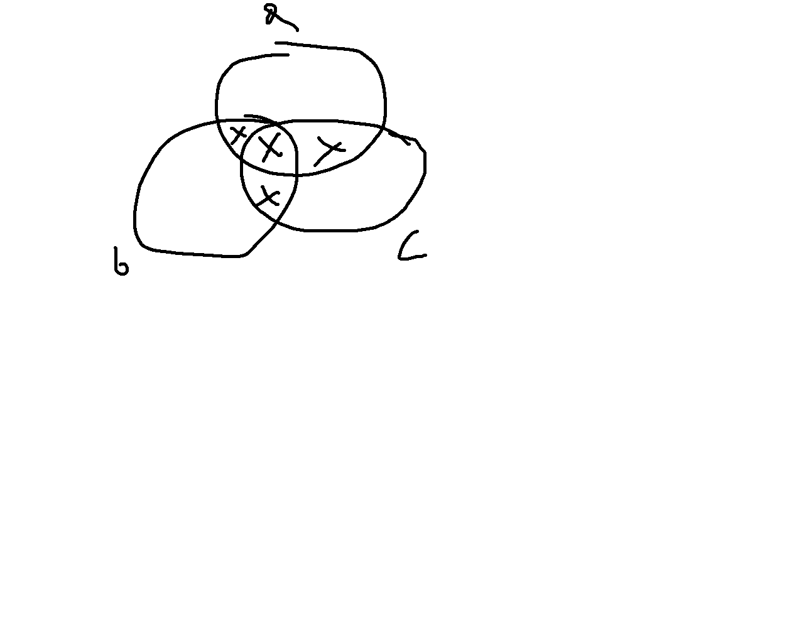
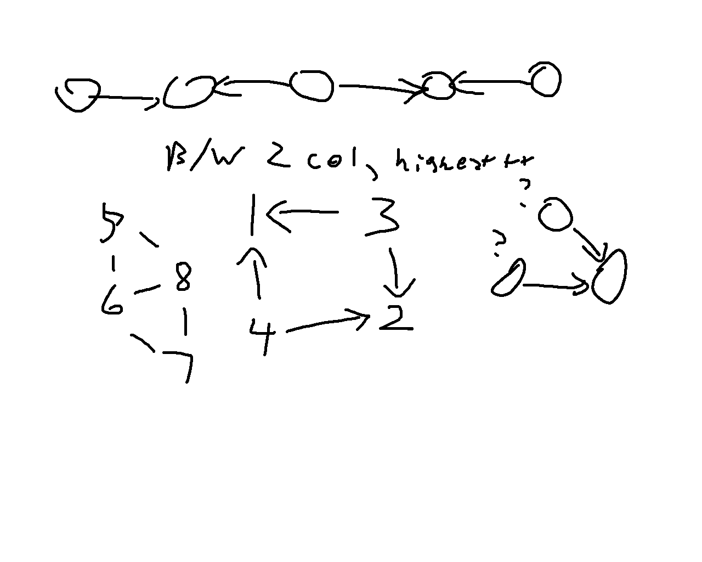
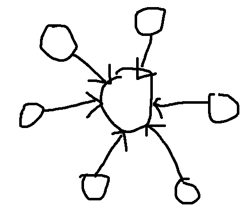

This post is up today solely to let you all know I'm currently in Orlando for the ICPC NA Championships. Also that I've been on dashboard in the last long bit and that there was a genuine 16 day gap since [LC Weekly 491](https://alxwen711.github.io/HonestCode/posts/2026/LC-weekly-491/).


## Solved Problems

### [A: Passing the Ball](https://codeforces.com/contest/2204/problem/A)

This problem could be simulated given the constraints. Eventual solution I ended up with was the following:

- If the first character is `R`, then keep traversing the string until an `L` is found. The ball would then be passed through all these `R`s to the `L` and then a back-and-forth passing pattern occurs.
- Otherwise, traverse the string backwards until a `R` is found, then the same back-and-forth pass pattern occurs.

**[Sample code](https://github.com/alxwen711/contestSubmissionArchive/blob/main/codeforces/live%20contests/2026-1/e188/a.py)**


### [B: Right Maximum](https://codeforces.com/contest/2204/problem/B)

Part of educational contests I find in the earlier problems is that it is practice for 'trial and error' type solving, ie. making a bunch of small testcases, solving them manually, finding the pattern, and then implementing the solution. In this case, I tried roughly the following sequence of sequences:

```
1 1 1 1 1  returns 5
1 2 3 4 5 returns 5
5 4 3 2 1  returns 1
1 1 2 2 3 returns 5
2 1 2 3 1  returns 3
2 2 3 returns 3
```

From these samples, it appeared that the method was to traverse left to right, and any time you find a value that is at least tied for the highest so far, add 1 to the answer.

**[Sample code](https://github.com/alxwen711/contestSubmissionArchive/blob/main/codeforces/live%20contests/2026-1/e188/b.py)**


### [C: Spring](https://codeforces.com/contest/2204/problem/C)

- Venn diagram for inclusion/exclusion
- There are more routine methods to this I'm pretty sure (if there were 10 people this would be a problem) but this suffices.
- Considered further complexion like https://codeforces.com/blog/entry/64625
- Also a general rule of add odds and subtract evens when subset counting, would not really apply here I think?



In this case making a diagram to manually compute the size of each of the 8 sections is easiest. We can define 7 constants `a, b, c, ab, bc, ac, abc` to indicate the number of days where the people indicated by the characters (e.g. `ab` is for Alice and Bob) are at the spring. Note that `a` also includes cases where other people than Alice are at the spring, but we'll deal with that complication later. Computing `a`, `b`, and `c` is just `n//a`/`n//b`/`n//c` respectively. The rest involve taking the `lcm` (least common multiple, ie. for `ab`, the smallest value x such that `x % a = 0` and `x % b = 0`) of the indicated people.

:::{.callout-tip}
The easiest method in Python is to just use `from math import lcm`. If you forget this then you could use the [Euclidian Algorithm](https://en.wikipedia.org/wiki/Euclidean_algorithm) to compute `gcd` first, which in a nutshell is that you replace the larger of two values you are taking the `gcd` for with the remainder when divided by the smaller number until one of the values is 0. For instance, `gcd(720,200) = gcd(120,200) = gcd(120,80) = gcd(40,80) = gcd(40,0) = 40`. Then `lcm` is computable via `gcd(a,b) * lcm(a,b) = a*b`, to which the proof is left as an exercise to the reader. (Hint: consider the prime factorizations of `a` and `b`.)
:::

Once you have the 7 constants, it's then a careful setup of adding and subtracting them to obtain the 7 individual segments in the Venn diagram above.

:::{.callout-note collapse="true"}
# Spoiler: Annotated Solution for the segments

```python
import sys
from math import lcm

#input functions
readint = lambda: int(sys.stdin.readline())
readints = lambda: map(int,sys.stdin.readline().split())
readar = lambda: list(map(int,sys.stdin.readline().split()))
flush = lambda: sys.stdout.flush()
readin = lambda: sys.stdin.readline()[:-1]
readins = lambda: map(str,sys.stdin.readline().split())

for _ in range(readint()):
    a,b,c,m = readints()
    # Computing the 7 constants
    ao = m//a
    bo = m//b
    co = m//c
    ab = m//lcm(a,b)
    ac = m//lcm(a,c)
    bc = m//lcm(b,c)
    abc = m//lcm(a,b,c)

    # Considering each section of the Venn diagram
    ansa,ansb,ansc = abc*2,abc*2,abc*2 # Case a, b, and c are at the spring
    
    # Cases where only two people are at the spring
    ansa += 3*(ab+ac-(2*abc)) 
    ansb += 3*(ab+bc-(2*abc))
    ansc += 3*(bc+ac-(2*abc))

    # Cases where only one person is at the spring
    ansa += 6*(ao-ab-ac+abc)
    ansb += 6*(bo-ab-bc+abc)
    ansc += 6*(co-bc-ac+abc)
    print(ansa,ansb,ansc)
```

:::

**[Sample code](https://github.com/alxwen711/contestSubmissionArchive/blob/main/codeforces/live%20contests/2026-1/e188/c.py)**


### [D: Alternating Path](https://codeforces.com/contest/2204/problem/D)

In this case, much of the visual notes I wrote provide my thought process more clearly:



- I immediately considered 2 colouring of the graph (checking if a graph segment's vertices can be coloured black and white such that no edge has it's nodes with the same colour) because if a triangle exists (or just any odd length cycle), there is no chance any node in that connected component can be beautiful.

- I initally coded up a solution where it just assumed all nodes in connected components with valid 2-colourings were beautiful only to find it failed sample cases, that's where the middle drawing comes into play. From here due to rushing I just assumed the maximum number of beautiful nodes in a connected component of n nodes was `(n+1)//2`.

- After that WA, then I determined the sun graph is a counter example:



- From there it was just tracking how many nodes of each colour were in the component and choosing the higher value.

**[Sample code](https://github.com/alxwen711/contestSubmissionArchive/blob/main/codeforces/live%20contests/2026-1/e188/d.py)**


### [E: Sum of Digits (and Again)](https://codeforces.com/contest/2204/problem/E)

> "It is always possible to rearrange the digits to the constraints."

This is a very strange addition to the problem statement as there are cases where a set of digits could not be rearranged in such a way such as `999`. Thus this entire thought process assumes there is a solution. First thing I did was compute the frequencies of each digit since they were being rearranged anyways. Then since this is a constructive problem (ie. any sort of problem that involves constructing a valid solution, post about constructive problems coming eventually) I then started considering the constraints of the sequence. There are at most 100000 digits, thus the maximum sum of these digits can only be 900000. At this point it is clear that whatever this sequence could be, it can't be that long; as an example, `number with digit sum 899999 -> 899999 -> 53 -> 8` is only a length 4 sequence, and the longest length of a sequence under these constraints could only be around 5. More importantly, we can then compute the digit sum of each sequence that starts from an integer of at most 900000, and then computing one more hypothetical step in a chain is simple. Then for a chain, the only two conditions to check are if the digit sum of a chain matches the digit sum of the given digits, and if we have the specific digits necessary to build the ending of the chain. The remaining digits can then be rearranged in decreasing order to guarantee a valid number.

All of this is probably better explained via example. Suppose we have a number `8989593990123456789...987654321` which has a digit sum of 900068. We can then determine that this can be rearranged into some form `9999...111000000899999538` based on the two conditions:

```
A chain starting at 899999 will require a digit sum of 900068 by these computations:
- Initial value with digit sum 899999 -> 899999
- 8 + 9 + 9 + 9 + 9 + 9 = 53
- 5 + 3 = 8
- 8 (needed to end the chain on a single digit)
- 899999 + 53 + 8 + 8 = 900068 

To build the above chain, the digits in 899999 -> 53 -> 8 are required to be in the string.
```

The first part can be optimized heavily using a dictionary to store the sums. The distribution of chain sums is even enough that there is no significant concern of having multiple possible chains on the same sum. The second part is then computable fast enough by using a hashmap and reconstructing the chain; each chain has at most 5 values, so while traditional Big-O complexity computation is somewhat difficult, we can reasonably assume this is at most $O(\log n)$, which is generally the criteria used for considering it a "fast" operation.

The other thing notable in my approach to this problem is that I initially considered a potentially faster (but also much more error prone) making a smaller setup where only the chains up to 53 were stored; in this case I would then have to consider if there was 1 or 2 extra values to be added in an answer chain. That method was dropped for the final approach as initial implementation of the 900000 chain approach also precomputed step 2 for EVERY chain, which gave me initial concerns of TLE as this took about 5 seconds on my computer. Since there are only 100000 strings in each test case at most (realistically 50000 since single digit strings are a base case), it is more efficient to not precompute these.

**[Sample code](https://github.com/alxwen711/contestSubmissionArchive/blob/main/codeforces/live%20contests/2026-1/e188/e2.py)**


## Unsolved Problems

### [F: Sum of Fractions](https://codeforces.com/contest/2204/problem/F)

- Looked at this and had little clue
- post contest this was 2238 vs 2620 for G, so both are very iffy

### [G: Grid Path](https://codeforces.com/contest/2204/problem/G)

- attempted a pseudo matrix multiplication attempt (not really but it's dp)
- idea from fast fib number computation
- end code was somehow overcounting
- I had a better idea of how to start this problem than F

**[Attempt code](https://github.com/alxwen711/contestSubmissionArchive/blob/main/codeforces/live%20contests/2026-1/e188/g2.py)**


## Contest Reflection

+9