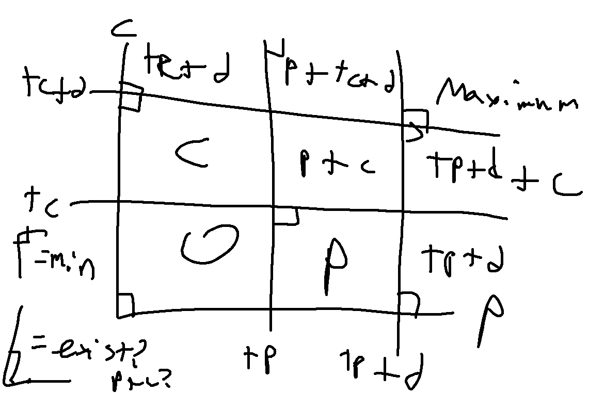
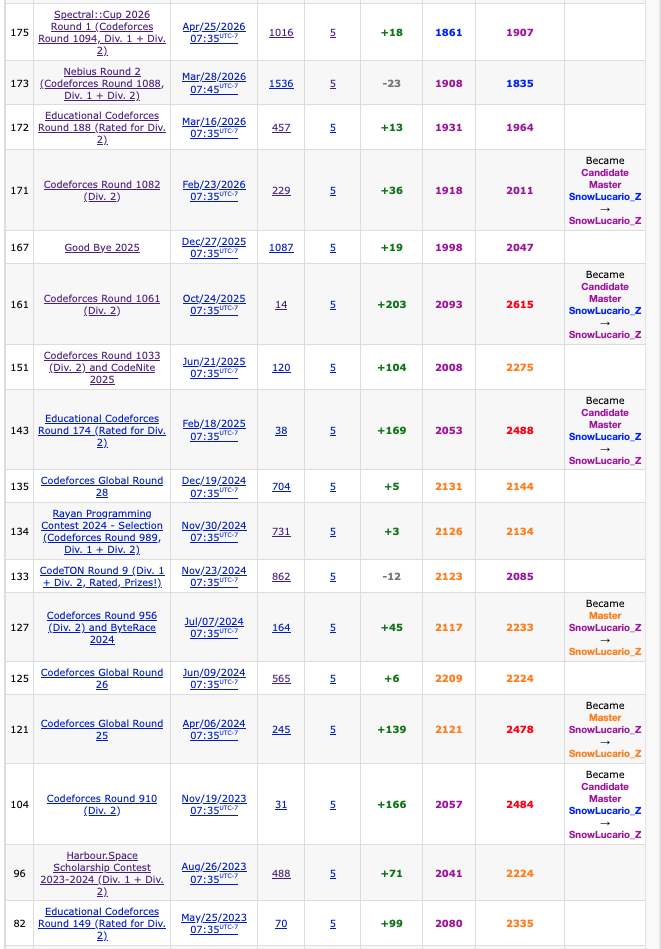

3 weeks after an [open contest with 5 problems solved](https://codeforces.com/contest/2222/standings/participant/235935685#p235935685) that led to what was somehow barely a CM level performance (CF in 2026!), we have me actually remembering to wake up for an educational round. I forgot last Saturday, my bad. We now observe if I actually drag myself back to 1900 after this one.

## Solved Problems

### [A: Optimal Purchase](https://codeforces.com/contest/2230/problem/A)

There are two primary cases:

1. If individual keys are at least as cost efficient as group keys ($3a \leq b$), then buying only individual keys is a minimally optimal cost of `n*a`.

2. Otherwise, generally buying group keys should be better, so as many of these should be bought as possible. There are cases where 1 or 2 individual keys should be bought as remainder if it's less optimal than getting another group key for the remaining students. This makes the solution either `floor(n/3)*b+(n%3)*a` or `ceil(n/3)*b`.

**[Sample code](https://github.com/alxwen711/contestSubmissionArchive/blob/main/codeforces/live%20contests/2026-2/e190/a.py)**


### [B: Digit String](https://codeforces.com/contest/2230/problem/B)

Using the digits from 1 to 4, these are the possible multiples of 4 to avoid:

`x4, x12, x32`

`x` can be replaced with any sequence of digits. Thus we need to remove all the 4's in the string first. Then an optimal number of removals is needed so that all the remaining 2's are at the start of the string. The two extreme solutions are either to remove all existing 2's or to remove all remaining 1's and 3's that are in front of a 2. But I figured there could be some sort of idea that combines both of these optimally; `122223332313` for instance would only require 2 removals. We then consider every combination of removing 1/3 from the left part of the list and removing 2 from the right part of the list. This can be done through a single traversal by setting a variable `v` to the number of 2's, then traversing the remaining string, subtracting 1 to `v` if it's a 2 and adding 1 otherwise. Then the minimal `v` value obtained at any given point would be the answer.

**[Sample code](https://github.com/alxwen711/contestSubmissionArchive/blob/main/codeforces/live%20contests/2026-2/e190/b.py)**


### [C: Arrange the Numbers in a Circle](https://codeforces.com/contest/2230/problem/C)

I somewhat guessed the answer here based on the testcases and other tested scenarios. These can be explained here. Suppose we have the following case:

```
5
2 2 2 2 2
```

This can be arranged in a full circle of 10 values (`1 1 2 2 3 3 4 4 5 5`); in fact the only problems we have is if we only have 1 copy of a number.

```
5
4 6 1 1 1
```

A full circle can also be arranged here as `1 1 3 1 1 2 2 4 2 2 5 2 2`. Generally, if there is `x` of a value, then `(x-2)//2` additional unique values can be inserted to split the majority into groups of two, which will still preserve the circle condition.

```
3
4 1 1
```

In the edge case where only 1 value of high frequency exists, this can still make a full circle `1 1 2 1 1 3`, so if only 1 value is at least 2, then another unique value can be included. These conditions are sufficient for a correct answer.

**[Sample code](https://github.com/alxwen711/contestSubmissionArchive/blob/main/codeforces/live%20contests/2026-2/e190/c.py)**


### [D: Good Schedule](https://codeforces.com/contest/2230/problem/D)

We first determine the conditions on which a segment would be good. Suppose Alice and Bob need to watch episode `x` next. Then if they are on day `i`, there must be a day `j` such that `A[j] = x` and `B[j] = x` and no such `k` where `i < k < j` and only one of `A[k] = x` or `B[k] = x` hold. Furthermore, we can also notice there will be a lot of repetitive computation occurring:

```
2 3 4 1 2 3 4 5 1
3 2 2 1 2 3 4 5 6
```

We can see here that the 4th to 8th day is a valid sequence, as well as any prefix of this. Furthermore, if we start from days 1, 2, or 3, the first episode is still going to be watched on day 4, and the other episodes still end up being watched in the same 4th to 8th day sub sequence. **Also importantly, any prefix of a valid sequence is valid.** This then leads to a pseudo-dp idea where we will solve the number of subsequences starting at each index going from back to front of the array. For each starting point `i`, we have 3 possible cases:

1. `ar[i] == 1 and br[i] == 1` - This scenario can be called a chain start; the task here is to extend this sequence as far as possible by checking if the second episode can be watched before encountering a case where only one person would watch the episode. If so, repeat with the next episode and so on or until the end of the array is reached.

2. `ar[i] != 1 and br[i] != 1` - By extending this sequence, you either have a case where only one of `ar[j] = 1` or `br[j] = 1` is true, in which case any prefix of `[i,j-1]` is valid, or you reach a chain start, in which case with memomization the maximum length sequence from this point can be computed.

3. `ar[i] == 1 xor br[i] == 1` - If only one condition holds then no sequence can ever start from this index as only one person would watch the first episode.

To then optimize the computations, we define the following reference arrays that are updated after each index `i` (recall these are still being traversed from `n-1` to `1`):

- `synch[x] = i` is the lowest value index `i` found such that `ar[i] = br[i] = x`.
- `disruption[x] = i` is the lowest value index `i` found such that `ar[i] = x and ar[i] != br[i]` or similarly `br[i] = x and ar[i] != br[i]`.
- `nextpos[i] = j` is only defined when `ar[i] = br[i]` and is the earliest index `j` such that `i < j` and index `j` contains either `ar[j] = ar[i]+1` and/or `br[j] = br[i]+1`. This is utilized to determine the next index to check for Case 1, as without it, the chain traversal could go backwards in the array such as this test case which failed the first attempt on this problem:

```
1 1 3 1 2
1 1 3 1 2
```

- `chains[i] = j` is updated after each Case 1 occurrance with the ending point of the chain logged for each new index traversed. This is mainly to prevent cases like below resulting in TLE as it would result in the full chain being traversed on each new instance where `ar[i] = br[i] = 1`.

```
1 1 1 1 1 ... 1 2 3 4 5 6 ...
1 1 1 1 1 ... 1 2 3 4 5 6 ...
```

**[Sample code](https://github.com/alxwen711/contestSubmissionArchive/blob/main/codeforces/live%20contests/2026-2/e190/d.py)**


## Unsolved Problems

### [E: Minimum Influence](https://codeforces.com/contest/2230/problem/E)

This is a case where I'm reasonably sure I have a solution idea, the issue is that I'm extremely sure there is something less complicated and I knew with about 20 minutes left it would be impossible to implement all of this. Each user can be thought of as a query that needs to be answered in at most $O(\log^2 n)$ time. Normally this would be $O(\log n)$ but there are two parameters to consider. We can map out the 9 possible influence scenarios below:



Let `c` be the culture value of the news item, `tc` be the user's tolerance for culture, `p` and `tp` be the same values but with politics, and `d` be the influence value, or range of possible tolerance scores.

1. `c < tc, p < tp` - In this case the influence score is 0.
2. `tc <= c < tc+d, p < tp` - Only culture score affects influence, thus score would be `c`.
3. `tc+d <= c, p < tp` - Only culture score affects influence, thus score would be `tc+d`.
4. `c < tc, tp <= p < tp+d` - Similar to Case 2, score would be `p`.
5. `tc <= c < tc+d, tp <= p < tp+d` - Only culture score affects influence, thus score would be `c`.
6. `tc+d <= c, tp <= p < tp+d` - Culture score is `tc+d`, political score is `p`, total is `tc+d+p`.
7. `c < tc, tp+d <= p` - Similar to Case 3, score would be `tp+d`.
8. `tc <= c < tc+d, tp+d <= p` - Similar to case 6, score would be `tp+d+c`.
9. `tc+d <= c, tp+d <= p` - Score would be `tc+d+tp+d` (both influence values hit maximum cap)
 
For cases 1, 3, 7 and 9, we can use a 2D segment tree (which I think is a segment tree but with four children at each node for each "quadrant" of the range to search further) to check for existance of an item in these ranges. Every other case except for 5 has only one parameter that is being aimed at being minimized so searching in those cases may be possible with a 2D sparse table (the segment tree can still be used but I find sparse table to be easier to setup here). Case 5 is the complete mess that I have a semblance of a clue on what to do; it seems possible to track `c+p` sums in each node of the segment tree and to only store minimums in the parents, then use this somehow for searching. The thing is, while I'm fairly sure this solution idea can technically work, actually implementing this is a complete nightmare and likely overkill for what is actually intended.

Now that I've written all of this, for some reason I did not consider that the queries in this case can be offline computed (ie. not done in order). This probably means there may be some sort of weird sweeping algorithm that can be used.

## Not Attempted

### [F: Game on Growing Tree](https://codeforces.com/contest/2230/problem/F)


## Contest Reflection

I remember back in the day when 4 problems was an automatic CM performance. I suppose now the average competitive programmer skill level has increased significantly even compared to a few years ago. Somehow this contest felt like I did quite solidly with only problem D really having significant errors made.

Now that I observe it, quite literally of the 16 contests where I had 5 problems solved, the last 5 cases of this are also the 5 contests with the overall lowest performance for me:



There is a slight note that 2 of the last 5 are technically 4 problem solves where one problem had multiple parts, but this has occurred before this such as in [Global Round 26](https://codeforces.com/submissions/SnowLucario_Z/contest/1984). There is also consideration that my pace isn't used to be, but I would think that at least one of these last 5 contests with 5 solves would be at least at a master level performance. Very unusual indeed.