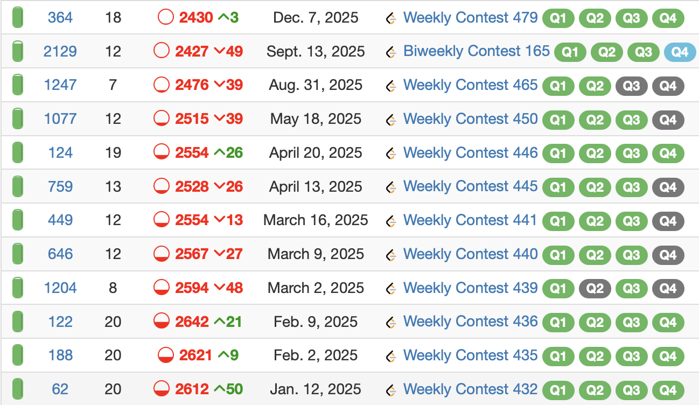

:::{.callout-important collapse="true"}

## Subtitle Context

This contest was part of a sequence of contests done in rapid succession, for which further context can be found in the February 23rd update for [this post](https://alxwen711.github.io/HonestCode/posts/2026/starters-226/#contest-reflection).
:::

I may consider this my 4th site for online competitive programming practice (behind CodeForces, AtCoder, and CodeChef in that order) due to the more technical interview type problems and overall contest structure being less than ideal (4 questions in 90 minutes, of which solving all four happens for up to a few thousand coders on a regular basis, making these contests boil down to speed a lot of the time), it's still good competitive programming practice. Plus, I want to turn around my 2025 results on Leetcode, which have been not great to say the least.



Given that this is an editorial, I think we can safely say this contest went quite well.


All clearing a Leetcode contest is actually expected of me at my current level, but it has been a long time since I've completed all the questions in under half an hour. The difficulty of this leetcode contest admittedly was dubious even by leetcode standards, but the overall execution was near perfect here which I find commendable. That and it's nice to have an easier contest considering this occurred shortly after attempting several problems from the 2026 ICPC European  
Championship as practice for the North American Championship. This more or less is my reflection for this contest, so what follows here is an editorial with some personal thoughts on the problems.

Assuming I remain at this rank, I should be around [Page 6](https://leetcode.com/contest/weekly-contest-490/ranking/6/?region=global_v2) on the leaderboard, for which you can access live code replays for my solutions. It's one of the good features in Leetcode as it's about as close to a 'livecode' experience you can get. If I'm not around here, then you can use the [Leetcode Rating Predictor](https://entranthub.com/contests/leetcode/weekly-contest-490?user=alxwen711) to check where I am, which generally is another useful tool for Leetcode, particularly with [numerical difficulty estimations](https://entranthub.com/contests/leetcode/questions) of most contest problems.

# Leetcode Weekly 490

### [A: Find the Score Difference in a Game](https://leetcode.com/contest/weekly-contest-490/problems/find-the-score-difference-in-a-game/description/)

This is a medium problem in name only, the actual solution is literally just implementation of all the game's features. 

**Annotated Solution**

```python
class Solution:
    def scoreDifference(self, nums: List[int]) -> int:
        n = len(nums)
        p = 0 # 0 = p1 scoring, 1 = p2 scoring
        a,b = 0,0 #p1 score, p2 score
        for i in range(n):
            if i % 6 == 5: p ^= 1 # swap scorer on every 6th round
            if nums[i] % 2 == 1: # swap scorer on odd round score
                p ^= 1
            if p == 1: b += nums[i]
            else: a += nums[i]
        return a-b
```

### [B: Check Digitorial Permutation](https://leetcode.com/contest/weekly-contest-490/problems/check-digitorial-permutation/description/)

- rearranging digits will not change sum of factorials
- thus just check for digit identicality between factioral sum and number

Rearranging the digits will not change the sum of the factorials. Thus, we can compute the factorial sum and then use basic hashmapping to check if the factorial sum and the digits occur in same frequency.

**Annotated Solution**

```python
class Solution:
    def isDigitorialPermutation(self, n: int) -> bool:
        s = str(n)
        fact = [1,1,2,6,24,120,720,5040,5040*8,5040*72] # fact[x] = x!
        # computing factorial sum
        v = 0
        for i in s:
            v += fact[int(i)]

        # comparing digit frequencies
        s = str(v)
        t = str(n)
        h = [0]*10
        for tt in t:
            h[int(tt)] += 1
        for ss in s:
            h[int(ss)] -= 1
        return h.count(0) == 10
            
```

### [C: Maximum Bitwise XOR After Rearrangement](https://leetcode.com/contest/weekly-contest-490/problems/maximum-bitwise-xor-after-rearrangement/description/)


Greedily choose the order of the digits in `t` to make a prefix of 1's for `s ^ t` as long as possible. 

**Annotated Solution**

```python
class Solution:
    def maximumXor(self, s: str, t: str) -> str:
        n = len(s)
        a = t.count("1") # number of 1's in t
        b = n-a # number of 0's in t
        ans = ["0"]*n
        for i in range(n):
            if s[i] == "1": # try to use a 0
                if b != 0:
                    b -= 1
                    ans[i] = "1"
                else: a -= 1
            else: # try to use a 1
                if a != 0:
                    a -= 1
                    ans[i] = "1"
                else: b -= 1
        return "".join(ans)
```

The one thing to note here is that `"".join(ans)` is used to join each of the characters in `ans` efficiently ($O(1)$ per two strings joined together taking $O(n)$ time in total). Common beginner error that I have made before is thinking `ans += c` and iterating through every character `c` works; this is actually an $O(n)$ time operation relative to string and would make the algorithm $O(n^2)$. 


### [D: Count Sequences to K](https://leetcode.com/contest/weekly-contest-490/problems/count-sequences-to-k/description/)

The challenge here is that brute force is just barely not possible since $3^{19} \approx 1.1 \text{ billion}$ possible sequences exist. There are several ways to optimize this enough to solve the problem and I ended using meet-in-the-middle. We can split the array `ar` into two halves `L` and `R`. Then if we let `x` end up as the result for an arbritary sequence from `L`, then if a sequence in `R` exists that produces the value `k/x`, we can combine these sequences to get a full sequence for `ar` producing `k`. Splitting the array in half optimally means at most we need to compute $3^9 + 3^{10} < 80000$ sequences, and then storing the values in dictionaries for comparison is sufficient. Lastly, to ensure exact computation, we can use some modulo arithmetic tricks for the [inverse](https://alxwen711.github.io/HonestCode/posts/2026/string-hash/#modular-arithmetic-review) since multiplying by inverse functions as division, keeping all of our computations in integers and with a sufficiently large prime, the probability of a collision is negligible.

**Annotated Solution**

```python
class Solution:
    def genall(self,ar,invs,m):
        # helper function to brute force all totals 
        # possible for a shorter array
        d = {}
        d[1] = 1
        for i in range(len(ar)):
            nd = {}
            for x in d.keys():
                v = d[x]
                if nd.get(x) == None: 
                    nd[x] = 0
                nd[x] += v
                a = (x*ar[i]) % m
                if nd.get(a) == None: 
                    nd[a] = 0
                nd[a] += v
                a = (x*invs[i]) % m
                if nd.get(a) == None: 
                    nd[a] = 0
                nd[a] += v
            d = nd
        return d
    
    def countSequences(self, nums: List[int], k: int) -> int:
        n = len(nums)
        m = 10**17-3
        ans = 0
        
        # split array in half and compute modulo inverses
        left = nums[:n//2]
        right = nums[n//2:]
        il = list()
        ir = list()
        for snth in left:
            il.append(pow(snth,m-2,m))
        for snth in right:
            ir.append(pow(snth,m-2,m))
        
        # brute force each subarray's totals
        da = self.genall(left,il,m)
        db = self.genall(right,ir,m)

        ans = 0
        for u in da.keys():
            """
            u is a found value from the left array brute force.
            u*pow(u,m-2,m) = 1, thus we need the right
            array value to be pow(u,m-2,m)*k % m. 
            """
            target = (pow(u,m-2,m)*k) % m
            if db.get(target) != None:
                ans += da[u]*db[target]
        
        return ans
```
