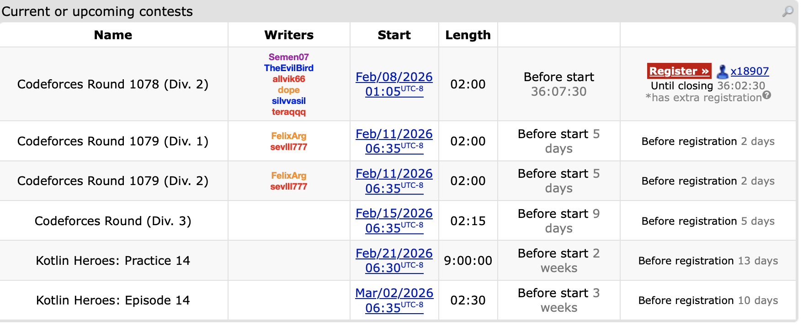
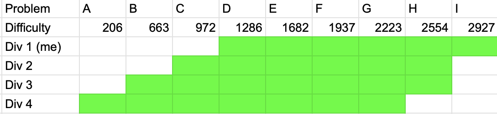
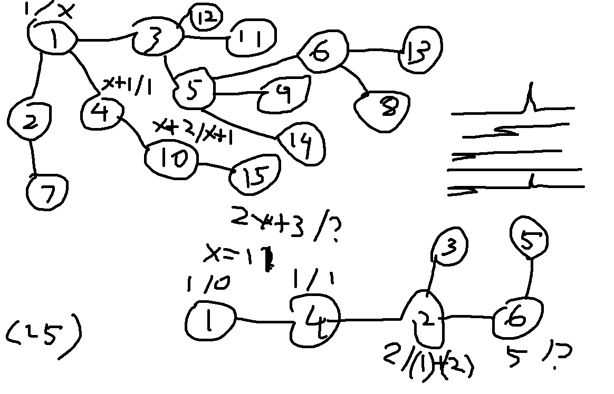

The last time I did a CodeChef contest was [September 18th, 2024](https://www.codechef.com/START152), and I wanted the first recap of HonestCode to be a CodeForces contest so I could showcase a decent start that gets me out of the Expert (1600-1899) rating group. However, as of writing this, this is the upcoming CodeForces contests:



Round 1078 is at 1AM, Round 1079 overlaps with my class times, the contest afterwards would be unranked for me, and the ones after that are part of the Kotlin series. But I really need some sort of programming competition for practice, so here we are with CodeChef's Starters series, which in terms of difficulty, the top division can be described as roughly for CodeForce rating from 1600-2099, which is roughly the equivalent of Division 2 on Codeforces in [Round 905](https://codeforces.com/blog/entry/121579).

::: {.callout-note collapse="true"}
## A brief side tangent on Round 905's division structure

Normally when contests on CF are divided into divisions, the standard has been to do Div 1 (1900 and up) and Div 2 (everyone else), usually by removing the 2 or 3 easiest problems from the Div 2 version and adding in 2 or 3 harder problems, similar to this table if the problems were arranged in difficulty:

| Problem # | 1  | 2  | 3 | 4 | 5 | 6 | 7  | 8  |
| --------- | -- | -- | - | - | - | - | -- | -- |
| Div 1     | \- | \- | A | B | C | D | E  | F  |
| Div 2     | A  | B  | C | D | E | F | \- | \- |

Round 905 is one of the most interesting in division structure as there were 3 groups: Div 1 (2100 and up), Div 2 (1600-2099), and Div 3 (everyone else).

| Problem # | 1  | 2  | 3  | 4  | 5  | 6  | 7     | 8  | 9  | 10 | 11 | 12 |
| --------- | -- | -- | -- | -- | -- | -- | ----- | -- | -- | -- | -- | -- |
| Div 1     | \- | \- | \- | \- | \- | \- | A1/A2 | B  | C  | D  | E  | F  |
| Div 2     | \- | A  | B  | \- | \- | C  | D1/D2 | E  | F  | \- | \- | \- |
| Div 3     | A  | B  | C  | D  | E  | F  | G1/G2 | \- | \- | \- | \- | \- |

This division structure has not been used much since probably because it requires several extra problems to be created, but for providing a more adaptive difficulty scale this was actually useful, especially since in the two division structure I tend to find myself in the Div 1/2 borderline area a lot (mainly the cycle of do well in Div 2, get run over in Div 1, repeat). Looking at this, there is a somewhat reasonable solution that can combine these ideas:

| Problem # | 1  | 2  | 3  | 4 | 5  | 6  | 7 | 8  | 9  | 10 |
| --------- | -- | -- | -- | - | -- | -- | - | -- | -- | -- |
| Div 1     | \- | \- | \- | A | \- | B  | C | D  | E  | F  |
| Div 2     | \- | A  | \- | B | C  | D  | E | F  | \- | \- |
| Div 3     | A  | B  | C  | D | E  | \- | F | \- | \- | \- |

This setup only needs 10 problems but the differences in each division should be significant enough. Even more, if we really wanted, there isn't anything really stopping a 4 division structure with 9 problems like this one below:

| Problem # | 1  | 2  | 3  | 4 | 5 | 6 | 7  | 8  | 9  |
| --------- | -- | -- | -- | - | - | - | -- | -- | -- |
| Div 1     | \- | \- | \- | A | B | C | D  | E  | F  |
| Div 2     | \- | \- | A  | B | C | D | E  | F  | \- |
| Div 3     | \- | A  | B  | C | D | E | F  | \- | \- |
| Div 4     | A  | B  | C  | D | E | F | \- | \- | \- |

Asides from the gap between Div 1 and 2 being pretty small, this contest structure could be an interesting experiment, and in fairness, if CodeChef can have a 4 division structure with fewer coders especially in the upper divisions, CodeForces could definitely try this. It would at least be a better implementation of Division 4 than the separate Div 4 contests that have been held on CodeForces, but this is separate post entirely.
:::

Anyways, this was how the problems were split up for each division in Starters 224:



There are 3 easier problems that were not part of the contest I did in division 1, and these solution ideas can be found in the following dropdown before more complete discussion on the other problems I solved and any thoughts/attempts on the last two problems.

::: {.callout-note collapse="true"}
## Division 1 Unranked Problems Upsolved

### [A: Qualified or Not](https://www.codechef.com/problems/QNOT)

From reading the problem, all that needs to be checked is if $N \geq 2X$ and $N \geq 2Y$. The sample code below is more an example of the lightweight input template I use.

```python
import sys

#input functions
readint = lambda: int(sys.stdin.readline())
readints = lambda: map(int,sys.stdin.readline().split())
readar = lambda: list(map(int,sys.stdin.readline().split()))
flush = lambda: sys.stdout.flush()

n,x,y = readints()
print("YES" if n >= 2*x and n >= 2*y else "NO")
```

### [B: The Coding Streak](https://www.codechef.com/problems/STREAK)

Keep track of the streak as you are going through the array; if the value is not 0, increment streak by 1, else reset to 0. After each day update the maximum streak found.

```python
import sys

#input functions
readint = lambda: int(sys.stdin.readline())
readints = lambda: map(int,sys.stdin.readline().split())
readar = lambda: list(map(int,sys.stdin.readline().split()))
flush = lambda: sys.stdout.flush()

for _ in range(readint()):
   n = readint()
   ar = readar()
   best = 0
   chain = 0
   for i in ar:
       if i != 0: chain += 1
       else: chain = 0
       best = max(best,chain)
   print(best)
```

### [C: AabBcCDd](https://www.codechef.com/problems/AABBCCDD)

Operation 1 can be performed any number of times, and the score of the banner is not affected by any uppercase letters, so changing the entire string to lowercase via operation 1 is a valid solution step. Then operation 2 can only be used once, so the greedy idea is to just make the two letters that show up the most in the string match each other.

```python
import sys

#input functions
readint = lambda: int(sys.stdin.readline())
readints = lambda: map(int,sys.stdin.readline().split())
readar = lambda: list(map(int,sys.stdin.readline().split()))
flush = lambda: sys.stdout.flush()
readin = lambda: sys.stdin.readline()[:-1]

for _ in range(readint()):
   n = readint()
   s = readin().lower()
   d = {}
   for i in s:
       if d.get(i) == None: d[i] = 0
       d[i] += 1
   ar = list()
   for j in d.keys():
       ar.append(d[j])
   ar.sort()
   if len(ar) == 1: print(ar[0]) # if only one letter type is in the string
   else: print(ar[-1]+ar[-2])
```

:::

## Solved Problems

### [D: Accommodation](https://www.codechef.com/problems/ACMDT)

- There must be enough space in a room for the minimal number of boys and girls
- There must be at least `(b+g+n-1)//n` rooms, call this value `r`
- There must be at least `xr` boys and `yr` girls

There are a few mathematical observations here to start:

- There must be enough space in a room for the minimal number of boys and girls, thus $x + y \leq n$.
- If at most $n$ people can fit in a room, then there must be at least $\lceil \frac{b+g}{n} \rceil$ rooms. Call this value $r$, and in code this is representable as `(b+g+n-1)//n`.
- There must be at least $xr$ boys and $yr$ girls to ensure each room meats the minimal number of boys and girls requirement.

If all of these conditions are true then $r$ rooms is the answer as any excess people could be fitted into the rooms by the second condition.

**[Sample code](https://github.com/alxwen711/contestSubmissionArchive/blob/main/codechef/starters%20224/a.py)**

### [E: Advitiya Coin](https://www.codechef.com/problems/ADC)

`Note that you do not need to maximize the overall profit of the trades: only the number of winning trades.`

The last sentence in the statement basically gives the solution away because it means that only the number of successful trades actually matters, and by greedy principle, we want to complete these trades as early as possible. Thus, we can determine when a trade is possible in a subarray by keeping a running track of the minimum and maximum of the subarray, then starting a new one once this difference exceeds $k$.

**[Sample code](https://github.com/alxwen711/contestSubmissionArchive/blob/main/codechef/starters%20224/b.py)**

### [F: MAX MIN MEX](https://www.codechef.com/problems/MAXMINMEX)

Among these permutation problems, it is implied that the array can be reordered arbitrarily. Let's observe an example larger test case written here:

```
1
10
3 7 8 9 10 12 13 14 15 17
```

The values in this list have been ordered intentionally. We also note that the value of $R_i$ will only keep increasing as the maximum of the array will never decrease when adding new elements and the minimum will never decrease. One possible arrangement that would result in a MEX value of 4 would be the following:

```
12 13 14 15 3 7 8 9 10 17
-> 0 1 2 3 12 12 12 12 12 14
```

Another possible arrangement is the following:

```
13 14 12 15 17 3 8 9 10 7
-> 0 1 2 3 5 14 14 14 14 14
```

What both of these arrangements do is place the values from 12 to 15 at the start. We can call 12 to 15 in this array the longest consecutive run, and all of the remaining values have no effect on the MEX value, so they can be placed in the back in any order (if there are $n$ of these, then there are $n!$ such ways to do so).

Suppose the length of the longest consecutive run is $m$, and that there are $k$ such longest consecutive runs (because an array like `1 2 3 5 7 8 9` has 2 longest consecutive runs of length 3). For a consecutive run of length $m$, there are exactly $2^{m-1}$ such ways to arrange it so that the resulting array will have the maximum MEX, which I ended up finding via trial and error (this may also be provable via induction). Multiply this value by $k$ and the number of ways to arrange all other elements not being used to create the MEX for the answer.

**[Sample code](https://github.com/alxwen711/contestSubmissionArchive/blob/main/codechef/starters%20224/c.py)**

### [G: Tree Walk 2](https://www.codechef.com/problems/WLKLIM2)

- Check time constraints -> at least O(n log n)
- How can the answer be large? (Considered line graph)
- Combinatorics are usually dp like problems, try splitting case where a node has been touched once/twice?

For this problem, I start by determining likely time complexity ($O(n \text{ log } n)$) of the solution. Initially I wasn't sure why the answer had to be returned mod 998244353, but from experimentation, the line graph ($n$ nodes where the only edges are 1-2, 2-3, 3-4, 4-5, etc.) could produce a case with a very large value, and this made it likely this had some sort of dp solution. This is another case where I tried figuring out how the test cases worked first, and eventually we get to these notes:



From drawing this out, there begins to be a clearer solution, which I figured out in the following stages:

- The unique path from 1 to n is needed for the dp part of the step.
- Each node $i$ in this unique path will have values $A_i$ and $B_i$ assigned to it representing the number of ways to reach this node by visiting it once or twice respectively.
- $A_j = A_i + B_i$ if node $j$ is the next node in the path after node $i$. In node 1's case, $A_1 = 1$.
- $B_i$ is dependent on the number of branching nodes that can be obtained by ignoring other nodes that would be in the path. This was observed in the testcase above, where $x = 11$ and it just happens that if you ignore node 4, there are 11 other branching nodes from node 1.
- From this, $B_i$ must equal the number of branching nodes multiplied by $A_i$. I only figured the multiplication part after finding that without it, the code would return $4$ on the 4th example when the answer is actually 5.
- Then the answer to this problem is $A_n$.

This entire thought process came through after about 45 minutes.

**[Sample code](https://github.com/alxwen711/contestSubmissionArchive/blob/main/codechef/starters%20224/d.py)**

## Unsolved Problems

### [H: MEX Variation](https://www.codechef.com/problems/MXCHG)

Like with F, ordering of values does not matter. For this problem I spent around 40 minutes trying to devise some sort of dp equation, using the lowest frequency of a specific value in a chain and the minimum number of operations needed to change the MEX as keys. The part that complicated things for me is considering cases with multiple chains such as `[0,0,0,0,0,0,0,5,5,5]` which should have an answer of 4.


### [I: Tree Walk 3](https://www.codechef.com/problems/WLKLIM3)

Verbally this problem is similar to G, but that's about where the similarities end. Most of the remaining time was on attempting H and from the solve statistics this problem is significantly harder. A part of me assumes there might be a tree dp idea for this as well, but post contest I am not really sure about this.

## Contest Reflection

[Based on recent contests](https://clist.by/coder/alxwen711/) the consistency I was having even problems roughly at the Division 2D level was rubbish, so retaining 2200 (6*) on CodeChef and actually going up in rating by 15 is a result that actually shows what I am capable of. Tree Walk 2 is a problem that would be about 1900-2000 on CodeForces from rough estimation, where as MEX Variation feels like it would be around 2200-2300. This contest did not have any penalty for wrong submissions, but it is worth noting that I wouldn't have a penalty anyways if there was one.


Each of these CodeChef Starters contests take place on Wednesdays 6:30-8:30AM PST. Usually I have class at 8AM on Wednesdays with this contest being an exception, and the next Wednesday where I'd be able to take part would be March 11th. I probably will compete in that Starters contest then; even if I feel AtCoder and CodeForces tend to have better problem quality (another post to be written at some point as to why), the problems on CodeChef are useful here, most of the issue is just a lack of competitions at the absolute top level.

