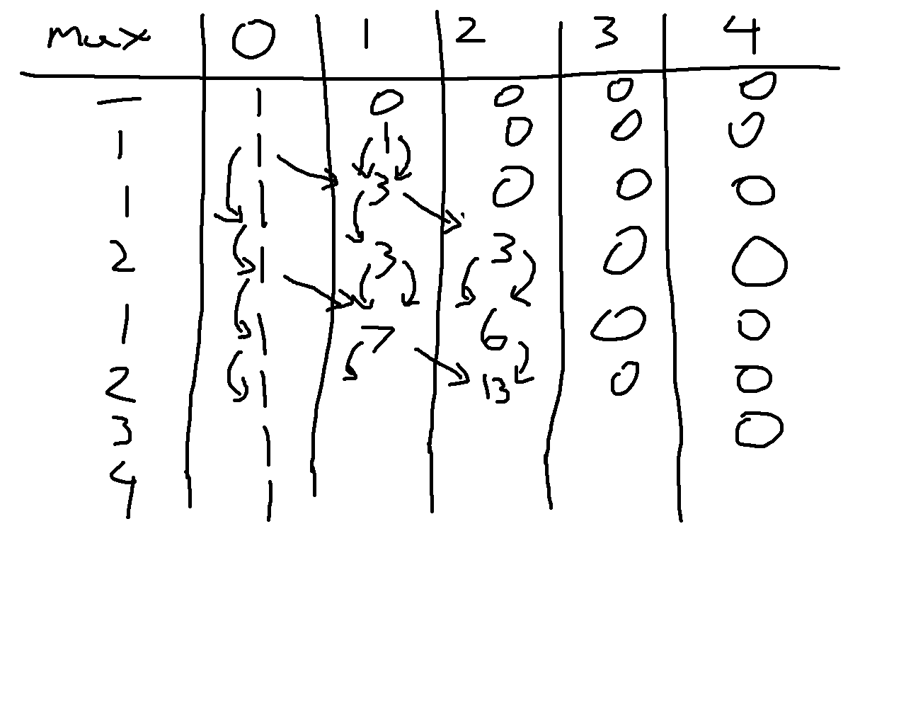

I seem to have not checked if this contest was rated beforehand, and it just happens this Starters contest is unranked for 6 star and up. Either way, this is an overview of the general approaches I took to each problem.

::: {.callout-note collapse="true"}
## Division 1 Unranked Problems Upsolved

### [A: Rush to Exam](https://www.codechef.com/problems/RUSHTOEXAM)

Chef is able to read $N * A$ pages at most, just compare this to $M$.

**[Sample code](https://github.com/alxwen711/contestSubmissionArchive/blob/main/codechef/starters%20226/starta.py)**

### [B: IceCream Cones](https://www.codechef.com/problems/ICECONE6)

Total amount of ice cream left is $X - YN$. If this is negative then the answer is 0.

**[Sample code](https://github.com/alxwen711/contestSubmissionArchive/blob/main/codechef/starters%20226/startb.py)**

### [C: Sub A Add B](https://www.codechef.com/problems/SUBAADDB)

In this case since $A > B$ is forced, you know that after one replacement operation the length of the string must decrease. Since this string is at most 100 characters anyways this process can be simulated which for the constraints of this problem is reasonable and less error prone than determing the largest integer $X$ such that $X < N$ and $X \mod (A-B) = N \mod (A-B)$.

**[Sample code](https://github.com/alxwen711/contestSubmissionArchive/blob/main/codechef/starters%20226/startc.py)**
:::

## Solved Problems

### [D: Minimum District](https://www.codechef.com/problems/MINDIS6)

I ended up struggling with this problem more than expected. The first idea tried was to binary search if there were enough operations so that only characters in a set prefix of the array appeared throughout. This method fails against arrays like `[1, 2, 3, 3, 3, 3, 3, 3, 3, 3]`. Then I just assumed a greedy idea by only matching with the most frequent values in the list, except there are cases like `[7, 5, 5, 5, 8, 8, 8, 6, 2]` where it's impossible to have everything match the 5 and 8. Only after this I then included the condition that the first value in the list must be included for the solution. Technically the only penalty due to wrong submissions on these contests is the time taken, which is not representative of most contests (usually there is some sort of penalty added in time from 5 to 20 minutes)

**[Sample code](https://github.com/alxwen711/contestSubmissionArchive/blob/main/codechef/starters%20226/a.py)**

### [E: Max Minus Min](https://www.codechef.com/problems/MAXMIN6)

There are two observations I initially made:

1. It is always optimal to either double the lowest value in the list or to leave it as is. Doubling any other value in the list will not increase the minimum but could increase the maximum, always leading to an inferior solution.

2. If we take an array like `[1, 100000]`, it will only take 17 operations under the first observation to increase the maximum. From this point onwards the max minus min value will spiral out of control. Thus it is likely that the optimal value will be found after at most $20n$ or so operations, where $n$ is the length of the list. Just to be safe I ended up using $25n$.

To efficiently obtain the minimum of the values, the `heapq` library can be used for $O(\log n)$ retrival. The number of operations at most then means this algorithm has a run time of $O(n \log n)$, although the higher coefficients make this function more like a $O(n \log^2 n)$ algorithm. Due to input size being limited to $n \leq 10^5$, this is still fast enough for Python to solve this in 0.91 seconds (time limit is 2 seconds). Faster can be achieved via manual implementation of the heap.

**[Sample code](https://github.com/alxwen711/contestSubmissionArchive/blob/main/codechef/starters%20226/b.py)**

### [F: Array Graph](https://www.codechef.com/problems/ARRGRAPH6)

From experimenting I assume that there is always a solution possible, which turns this into more of a constructive problem. Part of the experimenting and what is generally a good starting point is to consider the extreme cases:

```
2
6
1 1 1 1 1 1
6
1 2 3 4 5 6
```

For the first case, no rearranging is required, as this creates a star graph with an extra self loop, where every node is connected to node 1. In the second case, the simplest rearrangement is `2 3 4 5 6 1`, which results in 1 connecting to 2, 2 connecting to 3, 3 connecting to 4, and so on until 6 connects to 1, making a cycle graph.

When we consider cases in the middle, we can use a greedy idea. Begin by sorting the values in a list in order of decreasing frequency. You then want to use the values in this order to create edges that connect to each subsequent value in this list, ie. choosing the next most frequent value each time. Most likely, you will end up with several values that do not exist in the array being assigned edges to the already connected component at the end. If this isn't the case, then every value in the list was unique which results in this method creating a cycle graph.

**[Sample code](https://github.com/alxwen711/contestSubmissionArchive/blob/main/codechef/starters%20226/c.py)**

### [G: Good Subarrays](https://www.codechef.com/problems/GOODSUB6)

There was a initial working through of the testcase I tried only to then realize I had misinterpreted the problem statement as subsequences when they are only subarrays.



Such is the advice of **Read the problem statement carefully**. Anyways, even with this misread, it can be noticed that only subarrays starting with 1 can actually work, and this partially implies that any prefix of a good subarray is also good. Furthermore, concating two good subarrays creates another good subarray. Using this we can compute the `dist` (short for distance) of each index in the array to be the length of the longest subarray that is good that starts at this prefix. For instance, the `dist` array for the example testcase shown below:

```
[1,1,2,1,2,3,4]
[7,6,0,4,0,0,0]
```

It then follows that our answer will be `sum(dist)`. If we were to brute force each possible subarray, this would be $O(n^2)$. But since adjacent good subarrays create a larger good subarray, we can then do the following:

- Traverse the array backwards, stopping on each 1
- For the first 1, naively compute the `dist` value, track what the highest value in the subarray is
- For each 1 afterwards, the following cases can happen:
    - The subarray does not connect with the next 1 in the array
    - The subarray reaches the next 1; update the highest value, jump to the end of the found subarray, and continue if possible

Under this method computing the `dist` for each value will ensure that only new unchecked values actually get accessed multiple times, and on average, every element of the array will be checked at most twice, reducing this to $O(n)$.

**[Sample code](https://github.com/alxwen711/contestSubmissionArchive/blob/main/codechef/starters%20226/d.py)**

## Unsolved Problems

### [H: At least One](https://www.codechef.com/problems/ATLONE)

This problem there is definitely a dp equation that can be used for solving the problem. There is also a very significant loophole in that since $N \leq 2000$ and each answer will be at most 998244352 due to the modulo limit, it is possible to precomupte all 2000 possible answers to submit an "$O(1)$" solution, even if the precomputation step takes longer than $O(n^2)$. For a while I ended up trying this as I hypothesized the following $O(n^3)$ dp idea:

- Let `base[a][b]` be a temporary dp array, where `a` is the last integer value added to the set, `b` is the current function value, and this is tracking how many subsets have this combination. `0 <= b < a`.
- Base case is `base[1][0]` = 1.
- Then from each `base[a][b] = c`, any value from `a+1` to 2000 can be the next value, call this k.
- For each possible `k` value, increment `base[k][max(k-a,b)]` by `base[a][b]`, taking `mod m` if needed.

Within my attempts I had rearranged the dp equation to compute each `base[a][b]` value directly from previously computed values, which ends up with the following attempt code that went unsubmitted due to incorrect value for `n = 2000`. (Even though the other pretests were correct, so I'm very unsure where exactly this goes wrong).

**[Attempt Code](https://github.com/alxwen711/contestSubmissionArchive/blob/main/codechef/starters%20226/e.py)**

As of Friday post contest, I then tried implementing the exact dp method I set up here without any variations. Noticably even though this is also $O(n^3)$ this feels like it takes longer and there seems to be more operations involved. 

**[Attempt Code Part 2](https://github.com/alxwen711/contestSubmissionArchive/blob/main/codechef/starters%20226/e2.py)**

This still ends up with the wrong result for n = 2000 (645128103 instead of 904839774). In this scenario it is then best to return to this problem after a few days to relook at this dp equation as there is some sort of miscounting occurring here. As for looking at editorials, I don't do it. I only use editorials VERY rarely when it's a problem much easier than my level I should solve, and I'm absolutely confident after a few hours that I'm either overthinking it or the answer involves some basic fundamental concept that I have a knowledge gap in for some reason.

## Contest Reflection

Overall, if this was rated, I ended up performing about exactly to where my current 2219 rating would expect. That said I'd consider how I did here rather middling as D and G had several errors made that under most contest systems would be punished more heavily, and H feels very doable.

Next Saturday will be a bit crazy. Normally I would have classes during this contest, but it is reading week at UBC. This partially leads to me being able to do near whatever next Saturday, which of course means I will be doing the full competitive programming experience: [6:35 AM Codeforces Round 1081](https://codeforces.com/contests/2192), [10 AM UCUP Stage 17](https://contest.ucup.ac/contests) (contest link to be updated), and [6:30 PM Leetcode Weekly 490](https://leetcode.com/contest/weekly-contest-490/). Fun!

:::{.callout-important}
## February 23rd Update

It is the Monday after with this update, and while I initially planned to have each of these three contests recapped in a single post, many changes have occurred that I find it easier to have individual posts for each contest recap. The UCUP session practice will also not be recapped here since after some thought this is a more private practice session where we did Stage 16's contest instead, and based on the number of problems our team solved in practice it would be difficult to properly recap this contest. Turns out the ICPC European Championship has some very difficult problems. There will be a note on each of these posts linking the related contests on either February 21st or 23rd as well as in this callout here once all of the recaps are done.

:::

