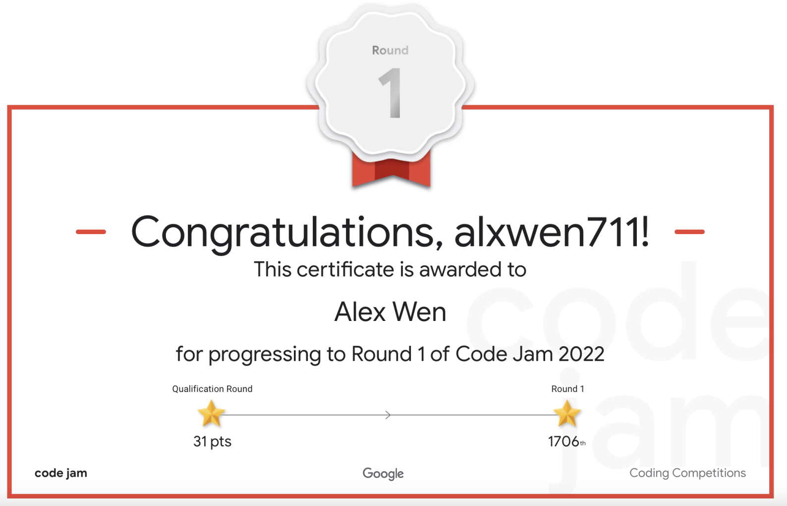

## May 1st-15th

Well then, congratulations to myself (sarcastically) for actually beginning this post in the same month this post is supposed to recap. I can finally say that this blog will be updated on a more consistent up-to-date basis now that the Spring 2022 SFU Term is finally behind me. There isn't much else to talk about other than the two contests that took place in these two weeks because after April 26th, being my last final exam of the term, I could completely chill and relax for a few weeks until the summer term started. There was absolutely nothing else that went wrong within those past few months.



::: {.callout-important}
## A Lookback on Google Code Jam

I won't lie, reading this now is a bit painful, seeing how unaware I was that 2022 would be the final year Google Code Jam would be held. The entirety of Google's coding competitions would fall under the demise of "budget cuts" in the following years, because running an annual competition with roughly 30000 competitiors that was seen as one of the most pristine annual competitions for finding top algorithmic content at a relatively inexpensive financial cost in the low millions at most was simply not enough for the shareholders. To this day I'm of the belief this reason was given to cover up that Google just wanted to get in bed with their developments in Generative AI more, which I will generously evaluate as having mixed results.

There is clearly much more I would discuss in a proper postmortem of this competition, as well as several problems within Google Code Jam that are quite intruiging deserving of their own posts, so I'll just end this sidenote here to prevent myself from ranting further. I only hope this blog remains as a demonstration that there are coders that truly do competitive programming for the love of the sport as it was always intended to be.
:::

As it turns out, in the last few weeks as of writing while I was scrambling to update this blog's March and April posts, I forgot about a little known competition that I participated in known as [**Google Code Jam**](https://codingcompetitions.withgoogle.com/codejam/schedule). For those unaware, this is one of the largest individual competitive programming competitions hosted by Google. When you combine my recent CodeForces successes and the fact that much of last month was a course load dumpload, it becomes more apparent why I made the mistake of not preparing that much for this competition. This led to me barely missing entry into Round 2 by finishing Rounds 1B and 1C in the top 2000 contestants, but just outside of the top 1500 that would advance from each sub round. I actually scored enough points in each sub round, but ended up being too slow to move on, either because I had too much of a penalty from wrong submissions, or because in my infinite wisdom, I did Round 1C in a sleep deprived state at 2am. There were only 3 questions in each round, making the skill gap between each question huge and put simply, Round 1 of Google Code Jam was a severe case of “SpeedForces”, ie. the faster, not better, coder wins. Yes, I am still salty over being just short twice. As for the problems themselves, they are best left to the [editorials (hosted on zibada unofficially, see the sidenote above)](https://zibada.guru/gcj/) put out by Google as with so few questions in each round, the questions I can recap are either relatively easy or ones I don’t completely understand how to solve, let alone begin.

As it turns out the Google Code Jam debacle was arguably still the most interesting contest I took part in in terms of how I did. There were two CodeForces contests in these two weeks, and looking back at them at the start of June, they can be best summed up as decent. [Round 788](https://codeforces.com/contest/1670) saw me getting Problems A through D correct on a relatively easy contest, and [Educational Round 128](https://codeforces.com/contest/1680) saw me get Problems A and B correct very quickly, only to completely implode on a much harder [Problem C](https://codeforces.com/contest/1680/problem/C) immediately afterwards. [My last submission](https://codeforces.com/contest/1680/submission/157073407) was only able to be a working O(n^2) solution when linear time was required, and I'm still not exactly sure of how to properly approach this question.

There wasn't much of a rating change from these contests but one other thing I would note is my method for solving [Problem D in Round 788](https://codeforces.com/contest/1670/problem/D). This is a case where a programming question can be pretty much solved with only math and not much actual coding work. The way I solved this was by taking a hexagon grid, and simply trying to make as many triangles as possible using 1 line, then 2, 3, 4, and so on. This gave me the sequence 0, 2, 6, 10, 16, 24, 32. This is where the online resource [OEIS](https://oeis.org) comes into play, as my guess was that this sequence of numbers had some sort of pattern. I had used OEIS before to figure out a programming problem where the solution ended up involving the Catalan numbers, so I assumed this would be a similar case. It turns out the sequence above does not show up in OEIS, but since all the values are even, I tried 0, 1, 3, 5, 8, 12, 16. This sequence ended up being f(x) = floor(x^2/3) and through some basic algebraic manipulation I came up with this humorously short solution for a normally complex problem:

```python
import sys
from math import sqrt
from math import ceil
 
for i in range(int(sys.stdin.readline())):
    n = int(sys.stdin.readline())
    x = (n+1)//2
    ans = ceil(sqrt(3*x))
    print(ans)
``` 

In other news, I began the SFU Summer Term by seeking a co-op position and one writing course in the form of CMPT 376W. Seeing that I’m writing this at the start of June, I can say that my plan to have only this one writing course reserved for its own term was a good one as the course is a lot of reading and writing. I know that sounds expected, but it was a welcome change considering that the last proper English course I took was back in high school. There’s not much else to recap on in these two weeks so let’s just go to the second half of May.

::: {.callout-tip}
My advice for good writing nowadays? Just write as you actually want to, then ask someone you represents your actual audience what they think of it. There is no need for the complex robotic doctrines I was subjected to in CMPT105W. If you think I'm being too harsh, I present the following sidenote.
:::

::: {.callout-warning collapse="true"}
## A Mildly Long Rant on Why CMPT105W is not a "Proper English Course"
A bit of added context to this paragraph, I did take a lower level writing course in my SFU undergraduate called CMPT105W. The reason I do not consider it a proper English course is because of the overreliance on the textbook (which functioned more as a draconian manual) as the sole source for "correct" writing, the micromanaged structure of the assignments, reviews, pop quizzes, and a final exam that was proctored online and to put simply, was a complete trainwreck (you were not allowed to go back to questions once you answered them). It took a few years to undo many of the bad habits that were forcibly wired into my writing for reasons of academic grading, and this blog assisted in reverting many vices such as: 

- Forced certainty when it does not exist
- Overemphasis on conciseness
- Writing as if this was a resume someone will spend 5 seconds looking at
- Utilizing approximately 11.5 words per T-unit to ensure clarity for a general audience while avoiding the pitfall of excessively complex vocabulary to bypass word count restrictions
- The entirety of the templates mandated for the informative and persuasive essays
- Using etc.; I'm sure this point has been made obvious enough, but 'etc.' was unironically considered a writing vice here.

The end result of this was a persuasive essay that I am ashamed to even be associated with, let alone have actually written. Technically, it's grammatically correct, which is the only positive I can state of it, as otherwise, it is garbage that even ChatGPT should not be able to defend.

::: {.callout-note collapse="true"}
## Another Brief Sidetrack For ChatGPT to Evaluate This Essay

We are now in a sidenote of a sidenote. I feel like [Tim Urban](https://waitbutwhy.com/2015/01/artificial-intelligence-revolution-2.html) now.

Just to check if the above was valid, I ended up running this 'persuasive' essay through ChatGPT telling it to objectively evaluate the paper under the same evaluation system that was used originally, while also making no note of who wrote it. Somehow, ChatGPT rates this essay at an 88% score, which is even higher than the original grade it got being 78%. When I had my friends evaluate this anonymously a few years ago, they rated it 70% and 50% respectively. I myself would have given myself 75% if following the actual rubric and 35% if it was on how convincing it actually was. Either way, ChatGPT's evaluation is impressively drunk, but I guess it finds a way to defend this paper. I will probably still upload said persuasive essay as a joke post some time in the future for further evaluation.
:::

Even though it has nothing to do with data science or competitive programming, part of me wants to reupload the persuasive essay I 'wrote' on this course and see how the general public would evaluate this essay. It would make for a good April fools joke, even if I'm describing it right here.

In case you actually are reading this monologue still, here's a fun fact: The word "paragraph" comes from the Ancient Greek word παράγραφος (paragraph) which means “marked passage”. I state this as the most positive use I got out of this course and an example of a question that appeared on the final exam. It technically wasn't this but asking about what number of words per T-unit corresponds to an 8th grade reading level is pretty close in obscurity and actual usefulness.
:::


## May 16th-31st

The fact that I am writing this entry on June 8th is a bit of a personal relief knowing that for once, I’m actually writing a recap on several contests that happened recently. Hopefully the future entries will follow this pattern and I will not end up writing an entry recapping June in something like October. Last entry I mentioned that I was taking one course in writing this term, and I would say that this blog is myself trying my best to explain technical matters (coding contests) in a comprehensible way. It’s not a direct reflection of my technical writing style as my tone in these entries is far too informal for that, but I think of this as practice for explaining concepts in writing. It’s also why I left previous entries exactly as I first drafted them, to showcase any improvement my writing made over these last few months. This is also the first entry that I’m actually writing in Google Docs rather than directly into a Vim text editor, so please excuse all of the grammatical and spelling mistakes I made in earlier entries.

Anyways, there are three Codeforces contests to recap. I’m also experimenting with a easier to read format for the contest recaps, feel free to send me feedback by email (alxwen711@gmail.com):

### [Round 792](https://codeforces.com/contest/1684)

Problems Solved: A, B, C, D

New Rating: **1719** (+117)

Performance: **2067**

There’s no other way to say it: I did well on this one.

Problems A and B were solved quickly without much trouble. [Problem C](https://codeforces.com/contest/1684/problem/C) was interesting, but not because of the problem itself. The solution to C is quite simple:

- Check if each row is sorted. If they are, then no swap is needed, and something like “1 1” can be outputted.

- If a row is unsorted, copy it and check how many values differ.

- If exactly two values differ, swap the two columns with wrong values and check again. Otherwise, 3+ values differ, and 1 swap cannot fix the grid.

- If after a swap there is still an unsorted row, then 1 swap cannot fix the grid.

It’s a simple solution, and I had no problems with it. So did around 6000 other coders, but what proceeded to happen is a phenomenon that I like to call a **STA**, a System Test Armageddon. From the 6736 coders who made a submission on Problem C, only 2935 received the Accepted verdict, meaning that nearly half of all submissions were victims of passing the pretests, but failing on a main test. This is a regular occurrence on CodeForces, but to see a STA of this scale is very rare, and is usually caused by pretests missing a key edge testcase. This wasn’t a language based issue like I initially thought, and the reasons behind this STA are still out of my grasp. What I can say is that within Python, there is already a built in sorting algorithm called with .sort(), and it’s best to rely on these in contests rather than creating ones that could be error prone, since most submissions that failed the main tests did so on a case where the array had duplicate values, something that could be unaccounted for by self-made sorting algorithms.

[Problem D](https://codeforces.com/contest/1684/problem/D) was different in that I still have no idea why my algorithm works, but I somehow got the Accepted verdict. The method I used is as follows:

- Assign a “score” to each value in the array; the score is equal to the value minus how far away from the end of the array the value is. This score is meant to determine how much damage could be avoided by skipping the given trap. For instance, using the first example array:

|Score|5|5|0|4| 
|Traps|8|7|1|4|

- Then jump over traps with the highest score. If there is a tie in score jump over the later trap. In the above example, the priority for traps to jump over is the 2nd one, then 1st one, then 4th one, then 3rd one.

The score metric is not an actual representation of how much damage can be saved by skipping the given trap, and yet this algorithm works. Such success was found by 2225 other competitors, giving this problem a 17% clear rate, which is high for a Problem D until you account that this was an open rating contest, meaning that the success rate on mid level Problems C to E are likely inflated compared to normal Division 2 contests.

Overall, I finished in the top 750 competitors in an open contest, I completed 4 problems in a Division 2 level contest for the 3rd time, and I nearly had a <span style="color:orange">**Master**</span> level performance. Pretty good if I say so myself.

### [Round 794](https://codeforces.com/contest/1686)

Problems Solved: A, B, C

New Rating: **1714** (-5)

Performance: **1694**

The loss in rating from this contest is more a result of myself inflating my rating from doing so well in the previous contest rather than underperforming here. If anything, this contest is a reflection of my goal for most contests. I solved the first three problems very quickly which left me over 90 minutes to attempt [Problem D](https://codeforces.com/contest/1686/problem/D). The only issue with this strategy is that this was a SpeedForces contest, seeing that the success rate from Problem C to Problem D dropped from 50.2% to 2.27%. Let’s just say, when there are coders in the top 300 that only solved 3 questions in this contest with nearly 10000 coders, that means Problem D was a massive difficulty spike. For those glancing at this question, it is not as simple as counting how many “AB” and “BA” sequences are possible. The problem tags indicate there is a greedy method to choosing which parts of the string are used for AB or BA; the furthest I got into solving this was that most likely you need to keep track of alternating substrings. Alternate substrings being substrings that are “ABABABA…” or “BABABAB…”, and allocate the 2 letter words to each of these starting from shortest to longest.

Upon writing the above I think I may have an idea for how to solve this question. I will further update this if I do have a working solution.

### [Round 795](https://codeforces.com/contest/1691)

Problems Solved: A, B, C

New Rating: **1677**(-37)

Performance: **1573**

I could almost copy and paste the first 3 sentences from the previous contest, except with [Problem C](https://codeforces.com/contest/1691/problem/C) I ended up having 4 wrong submissions before solving it. This wasn’t due to lack of knowledge as was more myself not considering all possible cases in the question. [Problem D](https://codeforces.com/contest/1691/problem/D) however is a sign that I might need to improve on questions involving binary search because the thought of using it never came to my mind.

That sums up the contests from the fifth month this year. As a last note for this entry, my future plans for this blog are mainly for my writing skills. Originally this was meant to be a place to mainly discuss the coding work I have done with this website, but the entire thing is pretty much just basic Markdown usage, so there would not be much to discuss on that front. As such, future entries are more focused on retaining this biweekly post structure, but being “more effective” in writing. What I mean by this is expressing information in a more efficient manner, since I have the issue in formal and casual writing to sometimes use absurdly long (50+ words) sentences.

That’s about it for May, and now I can officially say this blog is up to date. :D